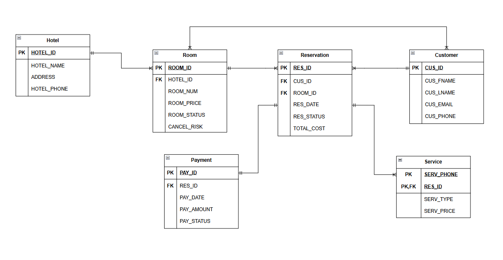

# COP-3710-Hotel-Booking

##Project Scope Statement:

Build a hotel booking database analyzing reservations, services, and pricing. Includes service management, cancellation risk (calculated based on price and time between booking and check-in date), and transaction-safe booking logic.

##Users:

Hotel owners, service employees, and customers.

##Data Sources:

Datasets from Kaggle,
https://www.kaggle.com/datasets/jessemostipak/hotel-booking-demand/data

##Database Application:

For conceptual model, draw.io will be used to create flowcharts of entities and entity relations in crow-foot notation.

For physical model, Oracle will be used to create the entity tables with attributes and assigned keys.

#Final ER Design Used: (Strong entities being Hotel, Room, Customer, and Payment)

